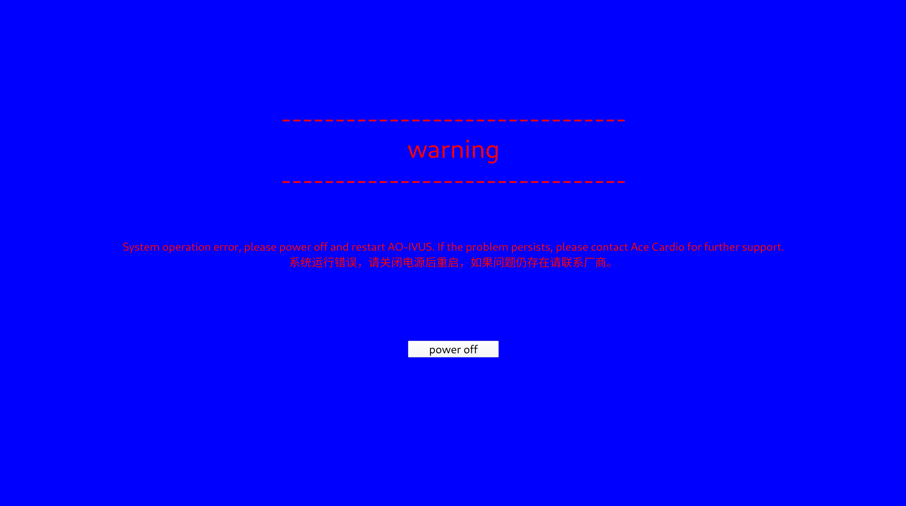

# crash window app
eton@250723 v1.0

## test:
```
appsiho-crashInfomationWindow --dryrun -L="warning" -M="System operation error, please power off and restart AO-IVUS. If the problem persists, please contact Ace Cardio for further support.\n系统运行错误，请关闭电源后重启，如果问题仍存 在请联系厂商。" 
```

- 
